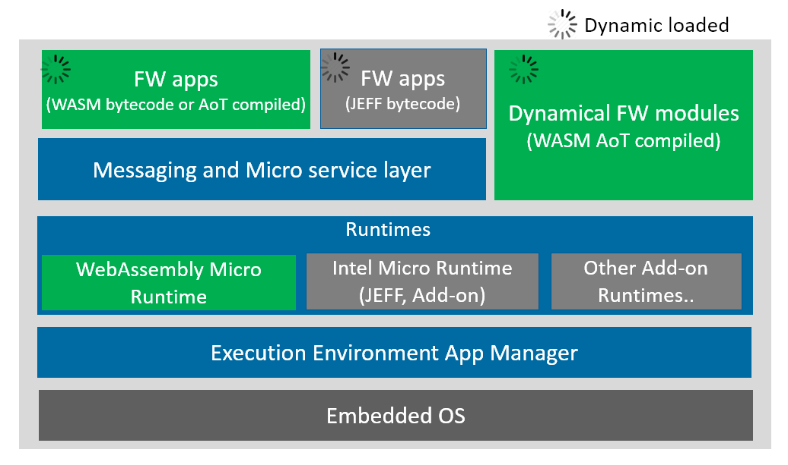

WebAssembly Micro Runtime
=========================
WebAssembly Micro Runtime (WAMR) is a small footprint and standalone WebAssembly (WASM) runtime. It provides a framework for dynamic WASM application management.

Features
=========================
- WASM interpreter (AOT is planned)
- Provide built-in Libc subset, support side_module=1 EMCC compilation option only
- Provide APIs for embedding runtime into production software
- Provide mechanism for exporting native APIs to WASM applications
- Support programming firmware apps in multi languages (C/C++/Java/Rust/Go/TypeScript etc.)
- App sandbox execution environment on embedded OS
- Pure asynchronized programming model
- Menu configuration for easy platform integration
- Support micro service and pub-sub event inter-app communication models
- Easy to extend to support remote FW application management from host or cloud

Architecture
=========================
WAMR is basically consist of three portions, WASM runtime engine, memory management, messaging and micro service support module.


 
  
The core function of WAMR is loading and running WASM application binary from local, and WASM applicaiton execution starts from the main entry. Belowing sections are about how to build WAMR core and WASM app, as well as run the WASM app by loading into WASM core.

Build WAMR Core
=========================
Please follow below instructions to build WAMR core on different platforms.

Linux
-------------------------
``` Bash
cd products/linux/
mkdir build
cd build
cmake ..
make
```
Zephyr
-------------------------
You need download Zephyr source code first and embeded WAMR into it.
``` Bash
git clone https://github.com/zephyrproject-rtos/zephyr.git
cd zephyr/samples/
cp -a <iwasm_dir>/products/zephyr/simple .
cd simple
ln -s <iwam_dir> iwasm
ln -s <shared_lib_dir> shared-lib
mkdir build && cd build
source ../../../zephyr-env.sh
cmake -GNinja -DBOARD=qemu_x86 ..
ninja
```

Build WASM app
=========================
A popular method to build out WASM binary is to use ```emcc```. 
Assuming you are using Linux. Please install emcc from Emscripten EMSDK following below steps:
```
git clone https://github.com/emscripten-core/emsdk.git
emsdk install latest
emsdk activate latest
```
add ```./emsdk_env.sh``` into path to ease future use, or source it everytime.
Emscripten website provides other installtion method beyond Linux.

todo: user should copy the app-libs folder into project and include and build.

You can write a simple ```test.c```as the first sample.
``` C
#include <stdio.h>
#include <stdlib.h>

int main(int argc, char **argv)
{
  char *buf;

  printf("Hello world!\n");

  buf = malloc(1024);
  if (!buf) {
    printf("malloc buf failed\n");
    return -1;
  }

  printf("buf ptr: %p\n", buf);

  sprintf(buf, "%s", "1234\n");
  printf("buf: %s", buf);

  free(buf);
  return 0;
}
```
Use below emcc commmand to build the WASM C source code into WASM binary.
``` Bash
emcc -g -O3 *.c -s WASM=1 -s SIDE_MODULE=1 -s ASSERTIONS=1 -s STACK_OVERFLOW_CHECK=2 \
                -s TOTAL_MEMORY=65536 -s TOTAL_STACK=4096 -o test.wasm
```
You will get ```test.wasm``` which is the WASM app binary.

Run WASM app
========================
Assume you are using Linux, the command to run the test.wasm is 
``` Bash
cd iwasm/products/linux/bin
./iwasm test.wasm
```
You will get output:
```
Hello world!
buf ptr: 0x000101ac
buf: 1234
```
If you would like to run test app on Zephyr, we have embedded test sample into its OS image. You need to execute 
```
ninja run
```

Embed WAMR into software production
=====================================
WAMR provided methodology to embed WAMR into your own software product, and defines APIs to enable software code (native) to invoke embedded WASM code.

The native code and WASM code execution flows are connected, but the stacks are seperated. WAMR enables the native code to invoke WASM code as invoking own native code transparently. Meanwhile WAMR guarantees the WASM code running inside sandbox.

A typical WAMR APIs usage is as below:
``` C
  wasm_module_t module;
  wasm_module_inst_t inst;
  wasm_function_inst_t func;
  wasm_exec_env_t env;
  wasm_runtime_init();
  module = wasm_runtime_load(buffer, size, err, err_size);
  inst = wasm_runtime_instantiate(module, 0, err, err_size);
  func = wasm_runtime_lookup_function(inst, "fib", "(i32i32");
  env = wasm_runtime_create_exec_env(stack_size);

  if (!wasm_runtime_call_wasm(inst, env, func, 1, argv_buf) ) {
          wasm_runtime_clear_exception(inst);
    }

  wasm_runtime_destory_exec_env(env);
  wasm_runtime_deinstantiate(inst);
  wasm_runtime_unload(module);
  wasm_runtime_destroy();
```


WASM application library and extension
=======================================
WAMR provides a set of basic application APIs.There are 3 sources of APIs for programming the WASM application:
- Built-in APIs: WAMR has already provided a minimal API set for developers. The minimal API includes:
  - Libc APIs, which is the minimal Libc APIs like memory allocation and string copy etc. It is defined in lib/app-libs/libc/lib-base.h;
  - Base library, which is the basic support like communication, timers and request/sub etc. It is defined is lib/app-libs/base/wasm_app.h;
  - Extension library, which is a reference code of library extension. Currently we provide an example of extending library to support sensors, the header file lib/app-libs/extension/sensor/sensor.h. It is a reference implementation for board vendors.
- 3rd party APIs: Programmer can download include any 3rd party C source code, and added into their own WASM app source tree.
- Platform native APIs: The board vendors define these APIs during their making board firmware. They are provided WASM application to invoke like built-in and 3rd party APIs. In this way board vendors extend APIs which can make programmers develop more complicated WASM apps.


Part 1. Libc APIs.
---------------------
The header files is ```lib/app-libs/libc/lib-base.h```. The API set is listed as below:
``` C
void *malloc(size_t size);
void *calloc(size_t n, size_t size);
void free(void *ptr);
int memcmp(const void *s1, const void *s2, size_t n);
void *memcpy(void *dest, const void *src, size_t n);
void *memmove(void *dest, const void *src, size_t n);
void *memset(void *s, int c, size_t n);
int putchar(int c);
int snprintf(char *str, size_t size, const char *format, ...);
int sprintf(char *str, const char *format, ...);
char *strchr(const char *s, int c);
int strcmp(const char *s1, const char *s2);
char *strcpy(char *dest, const char *src);
size_t strlen(const char *s);
int strncmp(const char * str1, const char * str2, size_t n);
char *strncpy(char *dest, const char *src, unsigned long n);
```

Part 2. Base library
----------------------
The header files is ```lib/app-libs/base/wasm-app.h```, it includes request and response APIs, event pub/sub APIs and timer APIs
The API set is listed as below:
``` C
typedef void(*request_handler_f)(request_t *) ;
typedef void(*response_handler_f)(response_t *, void *) ;

// Request APIs
void init_resource_register();

bool api_register_resource_handler(const char *url, request_handler_f);
void api_send_request(request_t * request, response_handler_f response_handler, void * user_data);
void api_response_send(response_t *response);

// event API
bool api_publish_event(const char *url,  int fmt, void *payload,  int payload_len);
bool api_subscribe_event(const char * url, request_handler_f handler);

struct user_timer;
typedef struct user_timer * user_timer_t;

// Timer APIs
user_timer_t api_timer_create(int interval, bool is_period, bool auto_start, void(*on_user_timer_update)(user_timer_t
));
void api_timer_cancel(user_timer_t timer);
void api_timer_restart(user_timer_t timer, int interval);
```

Part 3. Library extension reference
-------------------------------------
Currently we provide an example of sensor, the header file ```lib/app-libs/extension/sensor/sensor.h```, the API set is listed as below:
``` C
sensor_t sensor_open(const char* name, int index,
                                     void(*on_sensor_event)(sensor_t, attr_container_t *, void *),
                                     void *user_data);
bool sensor_config(sensor_t sensor, int interval, int bit_cfg, int delay);
bool sensor_config_with_attr_container(sensor_t sensor, attr_container_t *cfg);
bool sensor_close(sensor_t sensor);
```

APIs extension steps
---------------------
API extension means to export new “Platform API” to WASM apps, to develop more complicated WASM application for this platform. “Platform API” can be any function defined by the platform OS or the board firmware code. 

[Security attention] The WebAssembly application is supposed to access its own memory space. If the exposed platform API includes the pointers to system memory space which out of the app memory space, the integrator should carefully design some wrapper function to ensure the memory boundary is not broken.

WAMR implemented a framework for developers to export APIs. The procedure to expose the platform APIs in three steps:
- Step 1. Create a header file
Declare the APIs for WASM application source project to include.
- Step 2. Create a source file
Export the platform APIs, for example in ``` products/linux/ext-lib-export.c ```
``` C
#include "lib-export.h"

static NativeSymbol extended_native_symbol_defs[] =
{
};

#include "ext-lib-export.h"
```

- Step 3. Register new APIs
Use macro EXPORT_WASM_API and EXPORT_WASM_API2 to add exported APIs into the array of ```extended_native_symbol_defs```.
The pre-defined two MACROs below should be used to declare a function export:
``` c
#define EXPORT_WASM_API(symbol)  {#symbol, symbol}
#define EXPORT_WASM_API2(symbol) {#symbol, symbol_##wrapper}

The type of array extended_native_symbol_defs[] is defined as  below:
typedef struct NativeSymbol {
  const char *symbol;
  void *func_ptr;
} NativeSymbol;
```

Below code example shows how to extend the library to support GPIO pin operations on Zephyr OS:
``` C
//lib-export-impl.c
#include <zephyr.h>
#include <kernel.h>
#include <gpio.h>
static void customized()
{
   // your code
}
static int
gpio_pin_configure_wrapper(struct device *port, u32_t pin, int flags)
{
    return gpio_pin_configure(port, pin, flags); // a Zephyr OS API
}


// lib-export-dec.h
#ifndef _LIB_EXPORT_DEC_H_
#define _LIB_EXPORT_DEC_H_
#ifdef __cplusplus
extern "C" {
#endif

void customized();
int gpio_pin_configure_wrapper(struct device *port, u32_t pin, int flags);

#ifdef __cplusplus
}
#endif
#endif


// ext-lib-export.c
#include "lib-export.h"
#include "lib-export-dec.h"

static NativeSymbol extended_native_symbol_defs[] =
{
  EXPORT_WASM_API(customized),
  EXPORT_WASM_API2(gpio_pin_configure)
};

#include "ext-lib-export.h"
```
Use extended library
------------------------
In the application source project, it includes the WAMR built-in APIs header file and platform extension header files.
Assume the board vendor extend the library which added a API called customized(). The WASM application would be like this:
``` C
#include <stdio.h>
#include <stdlib.h>
#include <stdlib.h>
#include <stdlib.h>
#include “lib-base.h”           // provided by WAMR
#include “lib-export-dec.h” // provided by platform vendor

int main(int argc, char **argv)
{
  int I;
  char *buf = “abcd”;
  i = strlen(buf);                   // common API provided by WAMR
  customized();                   // customized API provided by platform vendor
  return i;
}
```


Submit issues and request
=========================
[Click here to submit. Your feedback is always welcome!](https://github.com/lucshi/test/issues/new)

