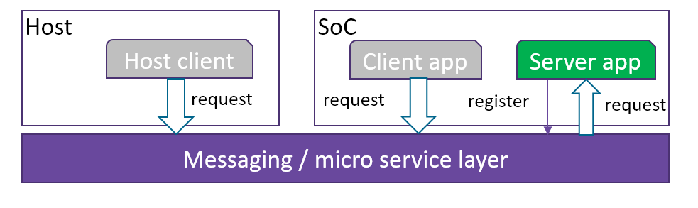

WebAssembly Micro Runtime
=========================
WebAssembly Micro Runtime (WAMR) is a small footprint standalone WebAssembly(WASM) runtime. By default it support running WASM binary on resource restricted (low as 150KB total memory) devices.

Feature
=========================
- Support programming fw apps in multi languages (C/C++/Java/Rust/Go/TypeScript etc)
- App sandbox execution environment on embedded OS
- Pure asynchronized communication
- Menu configuration for easy platform integration
- Support micro service and pub-sub event inter-app communication models
- Easy to extend to support remote FW application management from host or cloud

Architecture
=========================
WAMR is basically consist of three portions, WASM runtime engine, memory management, messaging and micro service support module.


Extension 
=========================
WAMR defined methodology and APIs to extend library, support app managment, extend to more language supppr, and enabled on more platforms.
A typical extention architecure is as below:

- App manager is the component to install and uninstall WASM apps from host or cloud.
- Communication is enabled inter WASM app as well as between WASM app and host/cloud
- Runtime glue and API extention is a layer to easily integrate other runtime, e.g. Jerryscript, Intel Java micro runtime and Lua runtime etc. into WAMR


Programming models 
=========================
After extention, WAMR supports two typical programming models, micro service model and subscription model. Each WASM app runs in dedicate thread and they communicate in pure asynchronized style so there is no blocking operations. 
- Single thread per WASM app instance
- Event driven model
- App must implement system callbacks on_init and on_destrory
- Support timer
- Micro service (Request/Response)
- Pub/Sub
- Support sensor


Micro service model
-------------------------
The micro service model is also referred as request and response model. One WASM app acts as server app which provides a specific service. Other WASM apps or host/cloud apps request from that service and get response.


Below is the sample code for server WASM app which provide a room temperature measurement service. In this demo case, it always returns 26.5 centigrades.

``` C
void on_init() 
{
  /* register resource uri */
  init_resource_register();
  api_register_resource_handler("/room_temp", room_temp_handler);
}

void on_destroy() 
{
}

void room_temp_handler(request_t *request)
{
  response_t response[1];
  attr_container_t *payload;
  payload = attr_container_create("room_temp payload");
  if (payload == NULL)
    return;

  attr_container_set_string(&payload, "temp unit", "centigrade");
  attr_container_set_float(&payload, "value", "26.5");

  make_response_for_request(request, response);
  set_response(response,
          CONTENT_2_05,
          FMT_ATTR_CONTAINER,
          payload,
          attr_container_get_serialize_length(payload));

  api_response_send(response);
  attr_container_destroy(payload);
}
```


Subscription model
-------------------------
The micro service model is also referred as monitor model. One WASM app acts as the event broadcastor. It broadcast events to WASM apps or host/cloud apps to notify their subscribed events occur.


Below is the sample code for pub WASM app which utilized a timer to repeatly publish an overheat event to the subcriber apps. Subscriber apps receive the events immediately.

``` C
void on_init() 
{
  api_subscribe_event (" alert/overheat", overheat_handler);
}

void on_destroy() 
{
}
void overheat_handler(request_t *event)
{
 printf(“Event: %s\n", event->url);
}

/* Timer callback */
void timer_update(user_timer_t timer) 
{
  attr_container_t *event;
  printf("Timer update %d\n", num++);
 
  event = attr_container_create("event");
  attr_container_set_string(&event, 
          "warning", 
          "temperature is over high");

  api_publish_event("alert/overheat", 
          FMT_ATTR_CONTAINER, 
          event, 
          attr_container_get_serialize_length(event));

  attr_container_destroy(event);
}
void on_init() 
{
    user_timer_t timer;
    timer = api_timer_create(1000, true, true, timer_update);
}
```


Use case on sensor hub firmeware
-------------------------
Programmers follow below steps to finish their app development:
- write WASM app code for firmware using C/C++ or other languages
- compile and test
- pack host app and WSAM app
- deploy in host
- host app installs WASM app onto device
- WASM app filters and fuses sensor events and provide UI display and interaction


Discussing
=========================
- [Click here to submit issues and requests. Your feedback is always welcome](https://github.com/lucshi/test/issues/new)

