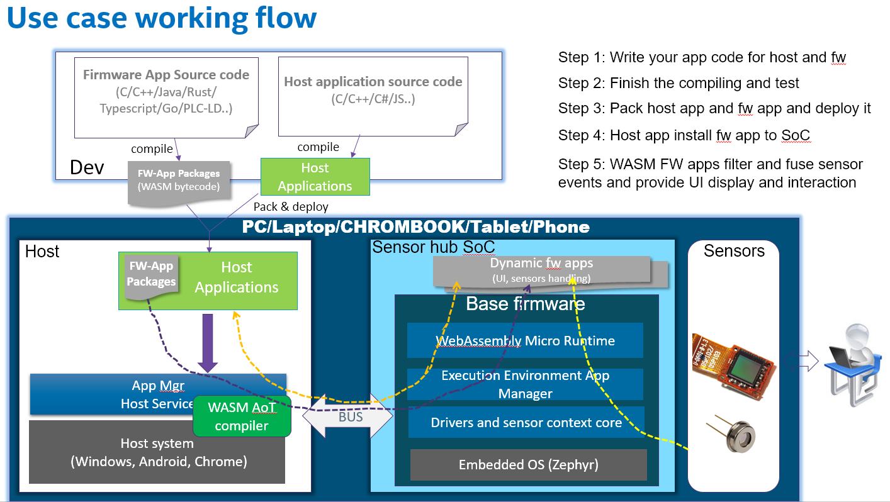

WebAssembly Micro Runtime
=========================
WebAssembly Micro Runtime (WAMR) is a small footprint and standalone WebAssembly (WASM) runtime. By default it supports running WASM binary on resource restricted (low as 150KB total memory) devices.

Feature
=========================
- Support programming firmware apps in multi languages (C/C++/Java/Rust/Go/TypeScript etc.)
- App sandbox execution environment on embedded OS
- Pure asynchronized communication
- Menu configuration for easy platform integration
- Support micro service and pub-sub event inter-app communication models
- Easy to extend to support remote FW application management from host or cloud

Architecture
=========================
WAMR is basically consist of three portions, WASM runtime engine, memory management, messaging and micro service support module.


Build WAMR
=========================
WAMR currently supports Linux, AliOS and Zephyr (a real time OS) platforms. Please follow below instructions to build WAMR source code on different platforms.

Linux
-------------------------
``` Bash
cd products/linux/
mkdir build
cd build
cmake ..
make
```
Zephyr
-------------------------
You need download Zephyr source code first and embeded WAMR into it.
``` Bash
git clone https://github.com/zephyrproject-rtos/zephyr.git
cd zephyr/samples/
cp -a <iwasm_dir>/products/zephyr/simple .
cd simple
ln -s <iwam_dir> iwasm
ln -s <shared_lib_dir> shared-lib
mkdir build && cd build
source ../../../zephyr-env.sh
cmake -GNinja -DBOARD=qemu_x86 ..
ninja
```

Build WASM app
=========================
A popular method to build out WASM binary is to use ```emcc```. 
Assuming you are using Linux. Please install emcc from Emscripten EMSDK following below steps:
```
git clone https://github.com/emscripten-core/emsdk.git
emsdk install latest
emsdk activate latest
```
add ```./emsdk_env.sh``` into path to ease future use, or source it everytime.
Emscripten website provides other installtion method beyond Linux.

You can write a simple ```test.c```as the first sample.
``` C
#include <stdio.h>
#include <stdlib.h>

int main(int argc, char **argv)
{
  char *buf;

  printf("Hello world!\n");

  buf = malloc(1024);
  if (!buf) {
    printf("malloc buf failed\n");
    return -1;
  }

  printf("buf ptr: %p\n", buf);

  sprintf(buf, "%s", "1234\n");
  printf("buf: %s", buf);

  free(buf);
  return 0;
}
```
Use below emcc commmand to build the WASM C source code into WASM binary.
``` Bash
emcc -g -O3 *.c -s WASM=1 -s SIDE_MODULE=1 -s ASSERTIONS=1 -s STACK_OVERFLOW_CHECK=2 \
                -s TOTAL_MEMORY=65536 -s TOTAL_STACK=4096 -o test.wasm
```
You will get ```test.wasm``` which is the WASM app binary.

Run WASM app
========================
Assume you are using Linux, the command to run the test.wasm is 
``` Bash
cd iwasm/products/linux/bin
./iwasm test.wasm
```
You will get output:
```
Hello world!
buf ptr: 0x000101ac
buf: 1234
```
If you would like to run test app on Zephyr, we have embedded test sample into its OS image. You need to execute 
```
ninja run
```

As to Zephyr and other embedded platforms or IoT platforms, we highly recommand to extend WAMR to support WASM app dynamic loading from host or cloud, as shown in below sections. WAMR provided methodology and APIs which makes the extension easy. 
For complete extension methodology, please read [WAMR extension guide](docs/iwasm_user_guide.docx).

(WAMR extension samples will be open sourced soon)

Extend WAMR to an open app framework 
=========================
WAMR defined methodology and APIs to extend its library, support app managment, extend to more language suppport, and enabled on more platforms.
A typical extension architecture is as below:

- App manager is the component to install and uninstall WASM apps from host or cloud.
- Communication is enabled inter WASM app as well as between WASM app and host/cloud
- Runtime glue and API extension is a layer to easily integrate other runtime, e.g. Jerryscript, Intel Java micro runtime and Lua runtime etc. into WAMR


Programming models 
=========================
After extension, WAMR supports two typical programming models, micro service model and subscription model. Each WASM app runs in dedicate thread and they communicate in pure asynchronized style so there is no blocking operations. 
- Single thread per WASM app instance
- Event driven model
- App must implement system callbacks on_init and on_destrory
- Support timer
- Micro service (Request/Response)
- Pub/Sub
- Support sensor


Micro service model
-------------------------
The micro service model is also referred as request and response model. One WASM app acts as server app which provides a specific service. Other WASM apps or host/cloud apps request from that service and get response.


Below is the sample code for server WASM app which provide a room temperature measurement service. In this demo case, it always returns 26.5 centigrade.

``` C
void on_init() 
{
  /* register resource uri */
  init_resource_register();
  api_register_resource_handler("/room_temp", room_temp_handler);
}

void on_destroy() 
{
}

void room_temp_handler(request_t *request)
{
  response_t response[1];
  attr_container_t *payload;
  payload = attr_container_create("room_temp payload");
  if (payload == NULL)
    return;

  attr_container_set_string(&payload, "temp unit", "centigrade");
  attr_container_set_float(&payload, "value", "26.5");

  make_response_for_request(request, response);
  set_response(response,
          CONTENT_2_05,
          FMT_ATTR_CONTAINER,
          payload,
          attr_container_get_serialize_length(payload));

  api_response_send(response);
  attr_container_destroy(payload);
}
```


Subscription model
-------------------------
The micro service model is also referred as monitor model. One WASM app acts as the event broadcaster. It broadcast events to WASM apps or host/cloud apps to notify their subscribed events occur.


Below is the sample code for a WASM publisher app which utilized a timer to repeat publish an overheat event to the subscriber apps. Subscriber apps receive the events immediately.

``` C
void on_init() 
{
  api_subscribe_event (" alert/overheat", overheat_handler);
}

void on_destroy() 
{
}
void overheat_handler(request_t *event)
{
 printf(“Event: %s\n", event->url);
}

void timer_update(user_timer_t timer) 
{
  attr_container_t *event;
  printf("Timer update %d\n", num++);
 
  event = attr_container_create("event");
  attr_container_set_string(&event, 
          "warning", 
          "temperature is over high");

  api_publish_event("alert/overheat", 
          FMT_ATTR_CONTAINER, 
          event, 
          attr_container_get_serialize_length(event));

  attr_container_destroy(event);
}
void on_init() 
{
    user_timer_t timer;
    timer = api_timer_create(1000, true, true, timer_update);
}
```


A open app framework usage scenario
-------------------------
Sensor hub firmware is an Intel companion chip connected with tons of sensors. It has limited resources and works in always on mode during main processor (host side) in deep sleep. WAMR is ported in sensor hub companion chip to make it intelligent to interact with end users according to environment changes, 7 days and 24 hours.
Programmers follow below steps to finish their app development:
- write WASM app code for firmware using C/C++ or other languages
- compile and test
- pack host app and WSAM app
- deploy in host
- host app installs WASM app onto device
- WASM app filters and fuses sensor events and provide UI display and interaction



Submit issues and request
=========================
[Click here to submit. Your feedback is always welcome!](https://github.com/lucshi/test/issues/new)

